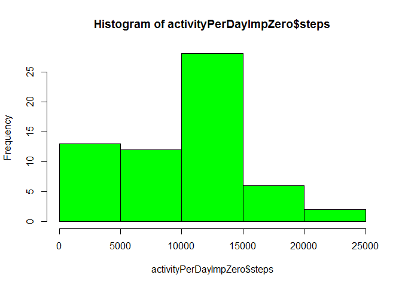

# Reproducible Research: Peer Assessment 1


## Loading and preprocessing the data


```r
library(plyr)
activity <- read.csv("data/activity.csv")
head(activity)
```

```
##   steps       date interval
## 1    NA 2012-10-01        0
## 2    NA 2012-10-01        5
## 3    NA 2012-10-01       10
## 4    NA 2012-10-01       15
## 5    NA 2012-10-01       20
## 6    NA 2012-10-01       25
```

```r
str(activity)
```

```
## 'data.frame':	17568 obs. of  3 variables:
##  $ steps   : int  NA NA NA NA NA NA NA NA NA NA ...
##  $ date    : Factor w/ 61 levels "2012-10-01","2012-10-02",..: 1 1 1 1 1 1 1 1 1 1 ...
##  $ interval: int  0 5 10 15 20 25 30 35 40 45 ...
```

## What is mean total number of steps taken per day?

1. Make a histogram of the total number of steps taken each day


```r
# ignore the missing values in the dataset
tidyData <- activity[!is.na(activity$steps), ]
activityPerDay <- ddply(tidyData, .(date), summarize, steps=sum(steps))
hist(activityPerDay$steps, breaks = "FD", col = "blue")
```

 

2. Calculate and report the mean and median total number of steps taken per day


```r
mean(activityPerDay$steps, na.rm = TRUE)
```

```
## [1] 10766.19
```

```r
median(activityPerDay$steps, na.rm = TRUE)
```

```
## [1] 10765
```

## What is the average daily activity pattern?

1. Make a time series plot (i.e. type = "l") of the 5-minute interval (x-axis) and the average number of steps taken, averaged across all days (y-axis)


```r
activityPerInterval <- ddply(activity, .(interval), summarize, averagesteps=round(mean(steps, na.rm = TRUE)))
with(activityPerInterval, plot(interval, averagesteps, type = "l"))
```

 

2. Which 5-minute interval, on average across all the days in the dataset, contains the maximum number of steps?


```r
activityPerInterval[which.max(activityPerInterval$averagesteps), ]
```

```
##     interval averagesteps
## 104      835          206
```

## Imputing missing values

1. Calculate and report the total number of missing values in the dataset (i.e. the total number of rows with NAs)


```r
sum(is.na(activity))
```

```
## [1] 2304
```

2. Devise a strategy for filling in all of the missing values in the dataset. The strategy does not need to be sophisticated. For example, you could use the mean/median for that day, or the mean for that 5-minute interval, etc.

* First strategy is to fill NAs with mean of all values from tha same interval

* Second strategy is to fill NAs with zero

3. Create a new dataset that is equal to the original dataset but with the missing data filled in.


```r
tidyDataWithMean <- within(merge(activity, activityPerInterval), {
    steps = ifelse(is.na(steps), averagesteps, steps)
})
tidyDataWithMean <- tidyDataWithMean[, 1:3]

tidyDataWithZero <- within(activity, {
    steps = ifelse(is.na(steps), 0, steps)
})
```

4. Make a histogram of the total number of steps taken each day and Calculate and report the mean and median total number of steps taken per day. Do these values differ from the estimates from the first part of the assignment? What is the impact of imputing missing data on the estimates of the total daily number of steps?

* Imputing with mean of all values from tha same interval


```r
activityPerDayImpMean <- ddply(tidyDataWithMean, .(date), summarize, steps=sum(steps))
hist(activityPerDayImpMean$steps, breaks = "FD", col = "red")
```

 

```r
mean(activityPerDayImpMean$steps, na.rm = TRUE)
```

```
## [1] 10765.64
```

```r
median(activityPerDayImpMean$steps, na.rm = TRUE)
```

```
## [1] 10762
```

* Imputing with zero


```r
activityPerDayImpZero <- ddply(tidyDataWithZero, .(date), summarize, steps=sum(steps))
hist(activityPerDayImpZero$steps, breaks = "FD", col = "green")
```

 

```r
mean(activityPerDayImpZero$steps, na.rm = TRUE)
```

```
## [1] 9354.23
```

```r
median(activityPerDayImpZero$steps, na.rm = TRUE)
```

```
## [1] 10395
```

The impact of imputing missing data depends on strategy:

1. In case of using **mean** instead of NAs the result is **very close** to source data

2. In case of using **zero** instead of NAs the result is **absolutely different**

## Are there differences in activity patterns between weekdays and weekends?


```r
activity$weekday <- weekdays(as.Date(activity$date))
weekend <- c("Saturday", "Sunday")
activity$daytype <- factor(ifelse(activity$weekday %in% weekend, "weekend", "weekday"))

par(mfrow = c(2,1))

weekdayData <- activity[activity$daytype == "weekday", ]
weekdayDataPerInterval <- ddply(weekdayData, .(interval), summarize, averagesteps=round(mean(steps, na.rm = TRUE)))
with(weekdayDataPerInterval, plot(interval, averagesteps, type = "l", main = "weekday"))

weekendData <- activity[activity$daytype == "weekend", ]
weekendDataPerInterval <- ddply(weekendData, .(interval), summarize, averagesteps=round(mean(steps, na.rm = TRUE)))
with(weekendDataPerInterval, plot(interval, averagesteps, type = "l", main = "weekend"))
```

 

Yes, there is a difference:

* during weekdays anonymous moves a lot in the morning

* during weekends anonymous moves evenly throughout the days 
